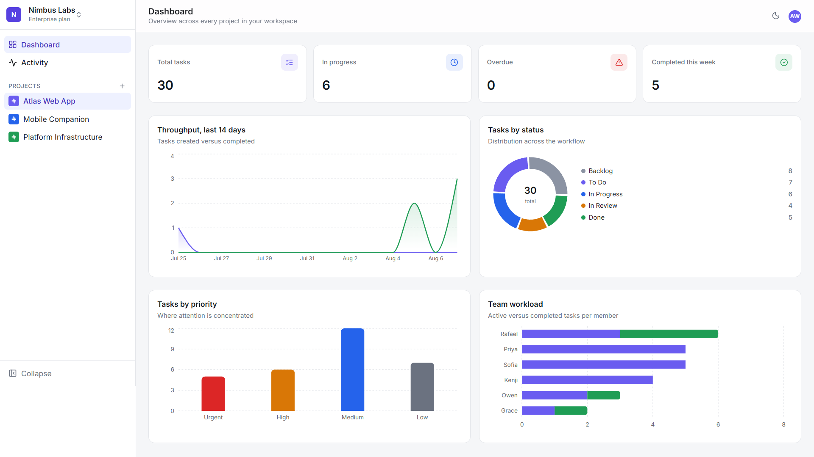
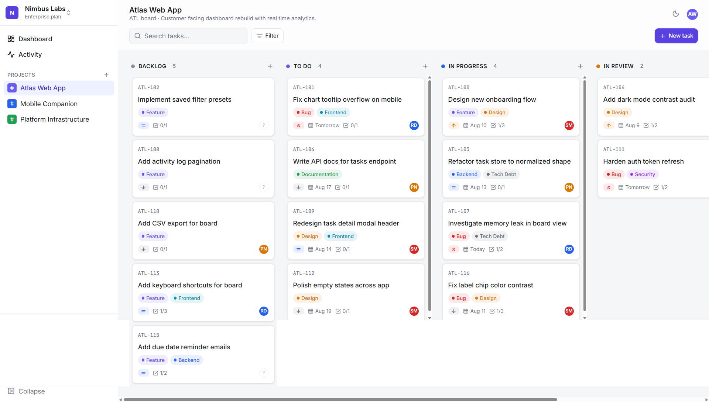
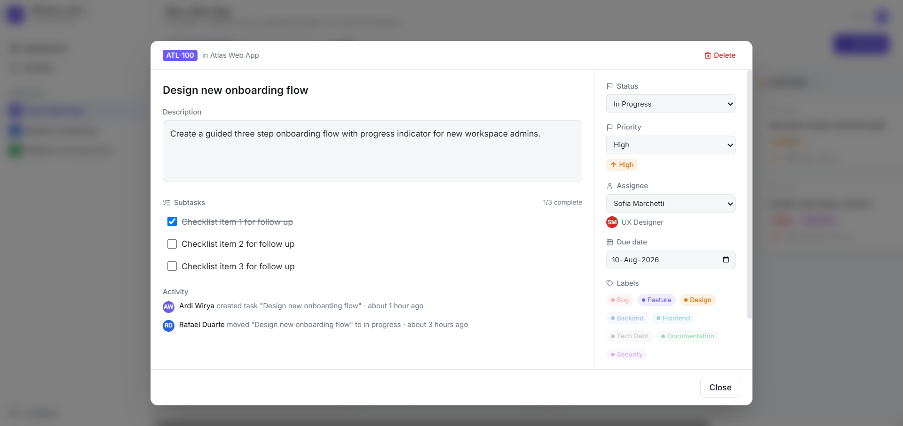

# Nimbus Project Management Dashboard

Nimbus is a project management dashboard built as a portfolio piece. It combines the Kanban workflow of Trello, the structured issue tracking of Jira, and the speed and visual polish of Linear into a single enterprise style SaaS interface.

The project is fully client side and uses realistic dummy data, so it can be explored end to end without a backend.

Live Demo: [Nimbus](https://nimbus-pm.vercel.app/) 

## Screenshots

<p align="center">


<p align="center">
  
  
</p>

## Features

- Kanban board with five workflow columns: Backlog, To Do, In Progress, In Review, Done
- Drag and drop task movement between and within columns, built with dnd-kit and full keyboard support
- Multiple workspaces, each containing multiple projects
- Task detail view with inline editing for title, description, status, priority, assignee, due date, labels, and subtasks
- Priority levels with color coded indicators: Urgent, High, Medium, Low
- Due dates with overdue detection
- Color coded labels that can be attached to any task
- Assignee and reporter fields backed by a shared team directory
- Global search across task title, code, and description
- Multi criteria filtering by status, priority, assignee, and label
- Dashboard analytics with charts for status distribution, priority breakdown, team workload, and a fourteen day throughput trend, built with Recharts
- Chronological activity log that records task creation, status moves, priority changes, due date changes, and assignment changes
- Fully responsive layout, from mobile through widescreen desktop
- Light and dark mode with a persisted preference and no flash on page load
- Complete dummy dataset covering multiple workspaces, projects, tasks, users, labels, and activity entries

## Tech Stack

- React 19 with TypeScript
- Vite as the build tool and development server
- Tailwind CSS for styling and design tokens
- Zustand for state management, split into app, task, and UI stores
- React Router for client side routing
- dnd-kit for accessible drag and drop
- React Hook Form for form state and validation
- Recharts for data visualization
- date-fns for date formatting and calculations
- lucide-react for icons

## Getting Started

### Prerequisites

- Node.js 18 or later
- npm 9 or later

### Installation

```bash
git clone https://github.com/ardiwirya/nimbus.git
cd nimbus
npm install
```

### Development

```bash
npm run dev
```

The app will be available at `http://localhost:5173`.

### Production Build

```bash
npm run build
npm run preview
```

`npm run build` runs a TypeScript project build followed by a Vite production build. The output is written to the `dist` directory.

### Linting

```bash
npm run lint
```

## Project Structure

```
nimbus/
├── docs/
│   └── screenshots/          # Screenshots used in this README
├── public/
│   ├── favicon.svg
│   └── icons.svg
├── src/
│   ├── components/
│   │   ├── activity/         # ActivityLog feed component
│   │   ├── common/           # Reusable UI primitives (Button, Modal, Avatar, etc.)
│   │   ├── dashboard/        # Chart and stat card components
│   │   ├── forms/            # React Hook Form based task creation
│   │   ├── kanban/           # Board, Column, TaskCard, TaskDetailModal
│   │   └── layout/           # AppLayout, Sidebar, Topbar
│   ├── data/
│   │   └── dummyData.ts      # Users, workspaces, projects, tasks, activity log
│   ├── hooks/
│   │   └── useFilteredTasks.ts
│   ├── lib/
│   │   ├── cn.ts             # Class name utility
│   │   └── dates.ts          # Date formatting helpers
│   ├── pages/
│   │   ├── ActivityPage.tsx
│   │   ├── BoardPage.tsx
│   │   └── DashboardPage.tsx
│   ├── store/
│   │   ├── useAppStore.ts    # Workspace, project, theme, sidebar state
│   │   ├── useProjectStore.ts # Project list and project creation
│   │   ├── useTaskStore.ts   # Tasks, drag and drop, activity logging
│   │   └── useUIStore.ts     # Search, filters, modal visibility
│   ├── types/
│   │   └── index.ts          # Shared TypeScript types and enums
│   ├── App.tsx                # Route definitions
│   ├── index.css              # Tailwind entry point and design tokens
│   └── main.tsx                # Application entry point
├── index.html
├── package.json
├── postcss.config.js
├── tsconfig.json
├── vite.config.ts
└── LICENSE
```

## State Management

The application splits global state into four focused Zustand stores instead of one large store.

- `useAppStore` holds the active workspace, active project, sidebar collapse state, mobile navigation state, and the current theme. The theme is persisted to local storage.
- `useProjectStore` owns the list of projects and exposes an action to add a new one, used by the create project form in the sidebar.
- `useTaskStore` owns the task collection and the activity log. It exposes selectors for reading tasks by project or status, and actions for moving, reordering, creating, updating, and deleting tasks. Mutating actions also append entries to the activity log automatically.
- `useUIStore` tracks the search query, active filters, and modal open state for the task detail and task creation dialogs.

Keeping these concerns separate avoids unnecessary re-renders and keeps each store easy to reason about.

## Design Notes

The interface follows an enterprise SaaS visual language: a neutral canvas background, a single indigo brand accent, restrained use of color reserved for status and priority signaling, and a monospace font for task codes to echo the issue tracker conventions of Jira and Linear. Every column, card, badge, and chip is a standalone component so the same primitives are reused across the board, the task detail modal, the creation form, and the dashboard.

## License

This project is licensed under the MIT License. See the [LICENSE](LICENSE) file for details.
